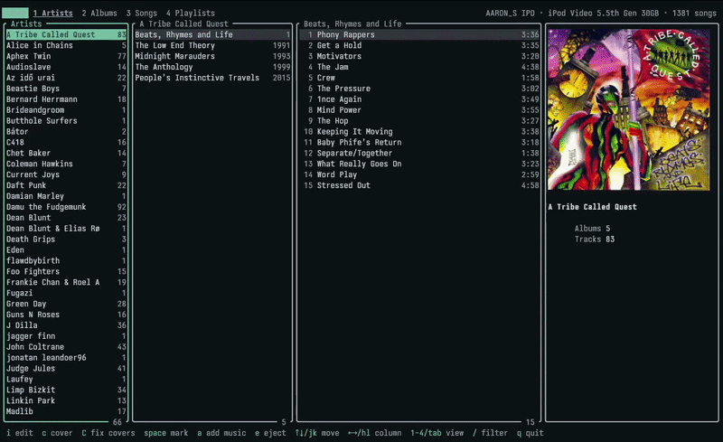
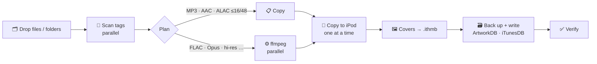

<div align="center">




### Your iPod, managed from the terminal. Fast.

**rPod** is a terminal iPod manager written in Rust. It reads and writes the iPod's own databases,<br>
shows real album art inside your terminal, and converts and syncs music with a single drag & drop.

<br>


[](LICENSE.md)

<br>

[Features](#-features) ·
[Install](#-install) ·
[Usage](#-usage) ·
[Adding music](#-adding-music) ·
[Compatibility](#-compatibility) ·
[Performance](#-performance) ·
[How it works](#-how-it-works)

</div>

<br>

```text
 rPod  1 Artists  2 Albums  3 Songs  4 Playlists                       iPod Video 5.5th Gen 30GB · 1366 songs
╭ Artists ───────────╮╭ Aphex Twin ─────────────────╮╭ Selected Ambient Works 85-92 ───────╮╭────────────────────────╮
│A Tribe Called Q  83││Selected Ambient Works  1992 ││  1 Xtal                        4:54 ││ ▗▄▄▄▄▄▄▄▄▄▄▄▄▄▄▄▄▄▄▄▖  │
│Alice in Chains    5││Richard D. James Album  1996 ││  2 Tha                         9:07 ││ ▐                  ▌  │
│Aphex Twin        77││Come To Daddy           1997 ││  3 Pulsewidth                  3:48 ││ ▐    album  art    ▌  │
│Audioslave        14││Windowlicker            1999 ││  4 Ageispolis                  5:23 ││ ▐   (real pixels   ▌  │
│Beastie Boys       7││Drukqs                  2001 ││  5 i                           1:17 ││ ▐    in Kitty)     ▌  │
│Chet Baker        14││Syro                    2014 ││  6 Green Calx                  6:05 ││ ▝▀▀▀▀▀▀▀▀▀▀▀▀▀▀▀▀▀▀▀▘  │
│Daft Punk         22││                             ││  7 Heliosphan                  4:53 ││ Tha                    │
│John Coltrane     43││                             ││  8 We are the music makers     7:43 ││ Aphex Twin             │
│Madlib            17││                             ││  9 Schottkey 7th Path          5:08 ││       Year 1992        │
╰─────────────── 65 ╯╰──────────────────────────── 6 ╯╰──────────────────────────────── 13 ╯╰────────────────────────╯
 a add music  e eject  ↑↓/jk move  ←→/hl column  1-4/tab view  / filter  q quit
```

<br>

## ✨ Features

<table>
<tr>
<td width="50%" valign="top">

### 🎧 Browse
- **Artists → Albums → Tracks** drill-down columns, Miller-style
- **Albums**, **Songs** and **Playlists** views
- **Real album art** rendered in the terminal (Kitty, WezTerm, Ghostty, Sixel, with a half-block fallback everywhere else)
- Live **`/` filter** on any column
- Track details: format, bitrate, sample rate, size, plays, skips, rating
- **Edit metadata** in a pop-up, for one track or a whole album at once
- **Find covers online** in a grid of real images, or fix every missing cover in one go

</td>
<td width="50%" valign="top">

### ➕ Add music
- **Drag & drop** files or folders straight onto the terminal window
- Converts anything the iPod can't play with **ffmpeg**, in parallel
- Lossless → **ALAC** or AAC/MP3. Hi-res is made iPod-safe automatically
- Embedded covers, or `cover.jpg`/`folder.jpg` as a fallback, or found online
- Multi-artist tags are kept whole ("Nujabes, Fat Jon")
- Skips songs already on the iPod, checks free space first

</td>
</tr>
<tr>
<td width="50%" valign="top">

### 🛡️ Safe by design
- Every chunk rPod doesn't need to change is **copied byte-for-byte**
- Databases are **backed up** before every write
- **Atomic** writes (temp file + rename) and a verification re-parse
- On failure, copied audio files are rolled back

</td>
<td width="50%" valign="top">

### ⚡ Fast
- Whole iTunesDB parsed in **~5 ms**
- Redraws only the visible rows. **~0.3 ms** per keypress
- Covers cached per album and loaded once scrolling pauses
- Each album cover is decoded and encoded **once**, not per track

</td>
</tr>
</table>

<br>

## 📦 Install

```bash
curl -fsSL https://raw.githubusercontent.com/erbator/rPod/master/install.sh | sh
```

Installs a static binary for **x86_64** or **ARM64 Linux** to `~/.local/bin`, verified against its SHA-256 checksum. On other machines it builds from source with cargo instead.

<details>
<summary><b>Options, uninstalling and building from source</b></summary>
<br>

```bash
# Pick a version or install location
curl -fsSL https://raw.githubusercontent.com/erbator/rPod/master/install.sh | RPOD_VERSION=v0.2.0 RPOD_INSTALL_DIR="$HOME/bin" sh

# Uninstall (keeps your settings and iPod database backups)
curl -fsSL https://raw.githubusercontent.com/erbator/rPod/master/uninstall.sh | sh

# Uninstall and delete settings + backups
curl -fsSL https://raw.githubusercontent.com/erbator/rPod/master/uninstall.sh | sh -s -- --purge

# Build from source
git clone https://github.com/erbator/rPod && cd rPod
cargo build --release   # → target/release/rpod
```

</details>

**Optional but recommended**

| Tool | Why |
|---|---|
| `ffmpeg` | converting FLAC, WAV, AIFF, Ogg, Opus and more into iPod formats |
| `udisksctl` | the <kbd>e</kbd> eject key (ships with most desktops) |
| [Kitty](https://sw.kovidgoyal.net/kitty/) / WezTerm / Ghostty | full-resolution album art |

<br>

## 🚀 Usage

Plug in your iPod, let your desktop mount it, then:

```bash
rpod                         # auto-detects the mounted iPod
rpod "/run/media/$USER/IPOD" # or point at it explicitly
```

### Keys: browsing

| Key | Action |
|---|---|
| <kbd>↑</kbd> <kbd>↓</kbd> / <kbd>j</kbd> <kbd>k</kbd> | move |
| <kbd>←</kbd> <kbd>→</kbd> / <kbd>h</kbd> <kbd>l</kbd> / <kbd>Enter</kbd> | move between columns |
| <kbd>1</kbd>–<kbd>4</kbd> / <kbd>Tab</kbd> | Artists · Albums · Songs · Playlists |
| <kbd>g</kbd> <kbd>G</kbd> / <kbd>PgUp</kbd> <kbd>PgDn</kbd> | jump |
| <kbd>/</kbd> | filter the current column |
| <kbd>i</kbd> | **edit metadata** of the selected track, album, artist or playlist |
| <kbd>space</kbd> | mark tracks to edit together |
| <kbd>c</kbd> | **find a cover** for the selected album, track or marked tracks |
| <kbd>C</kbd> | **fix missing covers** across the whole iPod |
| <kbd>a</kbd> | **add music** |
| <kbd>e</kbd> | eject the iPod safely |
| <kbd>q</kbd> | quit |

### Command line

```bash
rpod add ~/Music/Some\ Album     # add music without the TUI (prints timings)
rpod dump                        # print the whole database as text
rpod cover /path/to/ipod 42 out.png   # export track 42's cover
```

<br>

## 🎶 Adding music

Press <kbd>a</kbd>, or just **drop files onto the window**. Kitty pastes dropped paths, and rPod picks them up.

```text
╭ Add music ───────────────────────────────────────────────────────────────────────────────────────╮
│  Title                     Artist          Album              Source        Action               │
│✓ Opus Tone                 Opus Person     Opus Album         OPUS 78       → AAC 256 kbps       │
│✓ Hi-Res Sine               Test Artist     Test Album         FLAC 24/96    → ALAC (lossless)    │
│✓ MP3 Song                  Test Artist     Test Album         MP3 193       copy                 │
│  Undone - The Sweater Song Weezer          Blue Album         MP3 193       skip (on iPod)       │
╰───────────────────────────────────────────────────────────────────────────────────────── 4 files ╯
╭ Conversion ─────────────────────────────────────────╮╭ Summary ─────────────────────────────────╮
│ Lossless (FLAC, WAV, AIFF, APE) ‹ ALAC (lossless) › ││ 3 to add  1 copy  2 convert  1 skip      │
│ Ogg / Opus / Musepack             AAC 256 kbps      ││ ≈ 41 MB on the iPod                      │
│ Shrink MP3/AAC above              off               ││ Free: 17.06 GB → 17.02 GB                │
│ Parallel conversions              20                ││                                          │
│ Skip songs already on iPod        yes               ││                                          │
│ Folder art (cover.jpg) fallback   yes               ││                                          │
╰─────────────────────────────────────────────────────╯╰──────────────────────────────────────────╯
```

### Conversion options

| Setting | Default | Choices |
|---|---|---|
| **Lossless** (FLAC · WAV · AIFF · APE · WavPack) | ALAC | AAC 320 / 256 / 192 · MP3 320 · MP3 V0 |
| **Unplayable lossy** (Ogg · Opus · Musepack) | AAC 256 | AAC 192 / 128 · MP3 320 · MP3 V0 |
| **Shrink MP3/AAC above** | off | 320 / 256 / 192 kbps |
| **Parallel conversions** | CPU cores | 1 – 2× cores |
| **Skip duplicates** | yes | yes / no |
| **Folder art fallback** | yes | yes / no |

> [!TIP]
> Hi-res audio (above 48 kHz or 24-bit) is always converted to **16-bit / 44.1 kHz**. That's the iPod Video's hardware limit, and anything higher won't play.<br>
> Settings persist in `~/.config/rpod/settings.json`.

### The pipeline



Copies to the iPod go **one at a time** on purpose: the iPod Video has a tiny spinning hard disk, and parallel writes make it crawl.

> [!IMPORTANT]
> Press <kbd>e</kbd> (or eject from your desktop) before unplugging. The iPod rebuilds its menus from the new database when it's ejected.

### Backups & undo

Before every write, rPod copies `iTunesDB` and `ArtworkDB` to:

```
~/.local/share/rpod/backups/<FirewireGuid>/<unix-timestamp>/
```

To undo an import, copy those two files back into `iPod_Control/iTunes/` and `iPod_Control/Artwork/`.

<br>

## ✏️ Editing metadata

Press <kbd>i</kbd> on a track, an album, an artist or a playlist, or mark tracks with <kbd>space</kbd> first, and an editor pops up over the library.

- Title, artist, album, album artist, genre, year, track and disc numbers, composer, comment, compilation and ★ rating
- Fields that differ between tracks show as `‹mixed›`. Leave them alone and every track keeps its own value
- Changed fields are marked <code>●</code> before you save
- <kbd>n</kbd> numbers the tracks 1…n, <kbd>t</kbd> fills in the totals, <kbd>x</kbd> tidies stray spaces
- <kbd>Ctrl</kbd>+<kbd>S</kbd> saves to the iPod's database (with a backup and a verification pass) and, unless you turn it off with <kbd>f</kbd>, into the audio files' own tags too

<br>

## 🖼️ Album covers

Covers come from Apple's iTunes catalogue in up to **3000×3000**, or from any image file you drop in.

### <kbd>c</kbd>: pick one cover

A pop-up opens with the album already searched: a grid of real cover images, best match first and marked ★, unlikely ones dimmed.

| Key | Action |
|---|---|
| <kbd>←→↑↓</kbd> | choose a cover |
| <kbd>Enter</kbd> | apply it |
| <kbd>b</kbd> | jump back to the best match |
| <kbd>/</kbd> | type your own search |
| <kbd>Tab</kbd> | switch store country (your system's country by default) |
| *drop an image file* | use your own cover |

### <kbd>C</kbd>: fix every missing cover

rPod finds every album with tracks lacking art, searches for each in the background, and lists what it found:

| Status | Meaning |
|---|---|
| `confident 99%` | strong match that clearly beats the alternatives |
| `review 69%` | best guess, check it before accepting |
| `no match` | nothing usable; press <kbd>Enter</kbd> to search by hand or drop an image |

<kbd>y</kbd> accepts, <kbd>n</kbd> skips, <kbd>a</kbd> accepts every confident match, and <kbd>Ctrl</kbd>+<kbd>S</kbd> writes all accepted covers in one go, after a backup. Nothing is written before that.

### In Add music

<kbd>c</kbd> picks a cover for a queued album. <kbd>C</kbd> searches for every queued album without art and uses the confident matches automatically; the rest are left for <kbd>c</kbd>.

### How matching works

Long tags make bad search terms, so rPod tries up to three searches and merges the results: the main artist plus the album's core words, the album alone, then the artist's whole discography. Each result is scored on title (shared words as well as spelling), artist (any artist of a combined credit counts), track count and release year:

- A matching title by a clearly different artist is treated as a different album, so the band *Fallen Angels* doesn't beat the *Fallen Angels* soundtrack
- Titles in another script count as unknown rather than wrong, so a soundtrack Apple lists only under its Chinese title can still win on artist and track count
- "Confident" needs a high score *and* a clear lead over the runner-up, so near-ties always wait for you

The iPod gets its own thumbnails, and the audio files get a 1000 px JPEG embedded (switch off with <kbd>f</kbd> in the editor). Searches are paced to Apple's limit (about 20 a minute) and cached for a week in `~/.cache/rpod`.

<br>

## 🧩 Compatibility

| Device | Browse | Covers | Add music |
|---|:---:|:---:|:---:|
| **iPod Video 5G / 5.5G** | ✅ tested on a real 5.5G | ✅ | ✅ tested on a copy of a real database |
| iPod Classic 6G / 6.5G / 7G | 🟡 should work | 🟡 | ⛔ **not yet:** needs the *hash58* signature (also blocks editing and covers) |
| iPod nano 3G – 4G | 🟡 untested | 🟡 | ⛔ needs hash58 |
| iPod nano 5G – 7G | ❔ | ❔ | ⛔ needs hash72 / hashAB |
| iPod 1G–4G, mini, nano 1G–2G | 🟡 untested | — | 🟡 untested |
| iPod touch / shuffle | ❌ | ❌ | ❌ |

> [!WARNING]
> **Don't change anything on an iPod Classic (6G and later) yet**: no adding music, editing or covers. Those models refuse a database without a valid signature, and rPod doesn't write one yet. The iPod would show an empty library until the database is restored from the backup. Browsing is fine.

<br>

## 📊 Performance

Measured against a real 1,366-track iPod Video database (`cargo test --release bench -- --ignored --nocapture`):

| Operation | Time |
|---|---:|
| Open iPod (iTunesDB + ArtworkDB) | **~5 ms** |
| Build artist / album index | **< 1 ms** |
| Keypress + redraw, 1,366-song list | **~0.36 ms** |
| Scan 30 FLAC files (tags + art detection) | **~2 ms** |
| Import 30 FLAC → ALAC with covers (excluding USB copy) | **~0.32 s** |

<details>
<summary><b>What made it fast</b></summary>
<br>

- **Album-keyed art cache.** Every track of an album shares one image, so scrolling inside an album never re-sends pixels to the terminal. The last 48 albums stay ready.
- **Deferred cover loading.** Holding <kbd>j</kbd> sends no images. A new cover loads ~70 ms after scrolling pauses. Before this, every keypress pushed ~770 KB of image data to Kitty.
- **Windowed rendering.** Only the visible table rows are built each frame.
- **Decode once.** Covers are hashed before decoding, so each unique image is decoded once per import (other threads wait on it) and encoded into the iPod's RGB565 formats once.
- **One parse per file.** M4A files are parsed once to read both tags and codec (AAC vs ALAC).

</details>

<br>

## 🔬 How it works

rPod talks to the iPod's own on-disk formats directly, with no libgpod and no iTunes.

<details>
<summary><b>iTunesDB</b>: the music database</summary>
<br>

```text
mhbd                          database header
├─ mhsd type 1                tracks
│  └─ mhlt → mhit …           one per track, each followed by mhod strings
├─ mhsd type 2 / 3            playlists (3 = podcast-grouped copy)
│  └─ mhlp → mhyp …           mhod 52/53 sort indexes + jump tables, then mhip items
├─ mhsd type 4                album list (mhla → mhia)
└─ mhsd type 8                artist list (mhli → mhii)
```

When adding tracks, rPod appends `mhit`s, `mhip`s, `mhia`s and `mhii`s, and **regenerates the master playlist's sort indexes** (title, album, artist, genre, composer) and their letter **jump tables**. Those are what the iPod's Music menus are built from. Everything else is copied verbatim.

</details>

<details>
<summary><b>ArtworkDB + .ithmb</b>: the cover art</summary>
<br>

```text
mhfd
└─ mhsd type 1 → mhli → mhii …     one image entry per track (song id = track dbid)
                         └─ mhod 2 → mhni   one per thumbnail size
                                     └─ mhod 3   ":F1029_1.ithmb"
```

Thumbnails are raw **RGB565 little-endian** pixels at an offset inside `.ithmb` files. The iPod Video uses **100×100** (format 1028) and **200×200** (format 1029).

</details>

<details>
<summary><b>Source layout</b></summary>
<br>

| File | What it does |
|---|---|
| `bytes.rs` | bounds-checked little-endian chunk reader |
| `itunesdb.rs` · `artworkdb.rs` | parsers |
| `dbwrite.rs` · `artwrite.rs` | writers (append tracks, regenerate indexes, write thumbnails) |
| `device.rs` | find mounted iPods, read `SysInfo`, eject |
| `library.rs` | artist / album / song indexes |
| `import.rs` | scan, plan, ffmpeg, copy, commit |
| `app.rs` · `ui.rs` · `importui.rs` | the TUI |

</details>

<br>

## 🧪 Development

The tests that need iPod data read it from an environment variable, so none of your library ends up in the repo:

```bash
RPOD_TEST_IPOD=/path/to/ipod-copy cargo test --release
```

Point it at a **copy** of an iPod (a folder with `iPod_Control/{iTunes,Artwork,Device}`), never the device itself.

<br>

## 💛 Special thanks

**[DarkAaronfox](https://github.com/DarkAaronfox)** for lending me his iPod Video 5.5G, the device rPod was built and tested against.
Check out his project **[crabseek](https://github.com/DarkAaronfox/crabseek)**, a fast, keyboard-driven Soulseek client for the terminal, written in Rust.

<br>

## 🙏 Acknowledgements

- The **iPodLinux wiki** and **libgpod**, for years of reverse-engineering the iPod's formats
- **[iOpenPod](https://github.com/TheRealSavi/iOpenPod)** (GPLv3), used as a reference for field layouts. No code was copied
- **[Ben Dodson's iTunes Artwork Finder](https://bendodson.com/projects/itunes-artwork-finder/)**, for the artwork URL techniques
- **[ratatui](https://ratatui.rs)**, **[ratatui-image](https://github.com/benjajaja/ratatui-image)** and **[lofty](https://github.com/Serial-ATA/lofty-rs)**

<br>

<div align="center">

Licensed under the **[PolyForm Noncommercial License 1.0.0](LICENSE.md)**.<br>
Free to use, change and share for any noncommercial purpose. Commercial use isn't allowed.

<sub>Made for people who still think the click wheel was peak UI. 🎡</sub>

</div>
